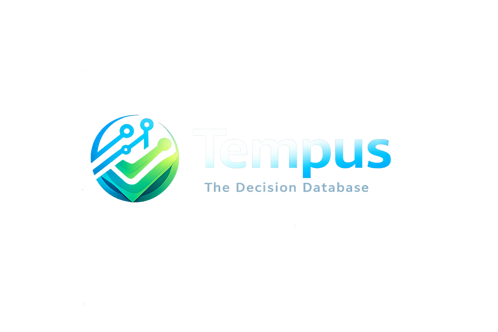

# The Decision Database: A New Primitive for AI Governance

## 1. ¿Qué es este proyecto? (Nuestra Categoría)
Este proyecto es la fundación técnica de una nueva categoría de software de infraestructura: **La Decision Database (DDB)**.

Mientras que una base de datos relacional (PostgreSQL) guarda *estado* y una base de datos vectorial (Qdrant) guarda *contexto semántico*, una **Decision Database guarda por qué los sistemas automatizados actúan**.

Nuestra misión es resolver el problema más grande de la adopción corporativa de Inteligencia Artificial: La falta de confianza, trazabilidad y auditabilidad (AI Governance). Con este sistema, cualquier empresa (Bancos, Logística, Seguros) puede permitir que Agentes Autónomos tomen decisiones críticas sabiendo que cada evento será filtrado por reglas deterministas (Rust/WASM) y sellado inmutablemente con un recibo criptográfico.

---

## 2. De dónde venimos y a dónde vamos

**De dónde salimos:**
Nacimos de la convergencia de dos motores independientes de alto rendimiento:
1.  **Tempus Engine:** Un motor matemático de reglas estáticas y deterministas (compilado en Rust). Originalmente pensado para simular comisiones y pricing dinámico.
2.  **Semantic Motor Seeker:** Un motor de búsqueda vectorial para recuperar contexto de documentos corporativos masivos.

**Hacia dónde vamos:**
Dejamos de ser "herramientas aisladas" para convertirnos en el **"Sistema Operativo de Gobernanza"** que se sienta entre los LLMs y la acción en el mundo real. 

El Roadmap actual se enfoca en posicionarnos bajo el manifiesto de la Decision Database:
1.  **Consolidación Técnica (Completado):** Ambos motores fusionados en una red única.
2.  **El Ledger de Decisiones (Completado):** Estructura de base de datos inmutable basada en recibos criptográficos.
3.  **Demo Visual "Brutal" (Siguiente Paso):** Construir el Dashboard *Decision Explorer* para hacer tangible el concepto ante inversores.
4.  **Lanzamiento (Futuro):** Publicación controlada de la Demo, la Landing Page y el Manifiesto Técnico.

---

## 3. Estado Actual de la Infraestructura (El "Motherboard")

La arquitectura ya no es teórica. La **Decision Database** se encuentra 100% operativa en local bajo un esquema de microservicios.

**Componentes Activos (Corriendo en `docker-compose.yml`):**
*   **PostgreSQL (`tempus-db`, puerto 5432):** El Ledger Inmutable. Alberga la tabla `decision_records` donde ninguna decisión puede ser alterada (candado legal).
*   **Redis (`redis`, puerto 6380):** Preparado para rate limiting y manejo de alto volumen.
*   **Qdrant (`qdrant`, puerto 6340):** El almacenamiento vectorial (La memoria del agente).
*   **Semantic API (`semantic-api`, puerto 8000):** El microservicio para consultar contexto.
*   **Tempus API (`tempus-api`, puerto 8001):** El **Kernel de Decisiones**. El motor en Rust que procesa la lógica a microsegundos y emite el *Cryptographic Receipt*.
*   **Tempus Dashboard (`tempus-dashboard`, puerto 3000):** La interfaz visual. Ya cuenta con el **Decision Explorer** (`/explorer`) funcional y la página de **Pitch** (`/pitch`) para inversores.

**Endpoints de Gobernanza Operativos:**
1.  `POST /api/v1/govern/decide`: Recibe solicitud de agente -> Ejecuta regla -> Devuelve Sello Criptográfico (Receipt). *(El evento causal)*.
2.  `GET /api/v1/govern/audit/{receipt}`: Comprueba matemáticamente que la decisión no ha sido manipulada (Anti-Tamper). *(El auditor)*.
3.  `GET /api/v1/govern/explain/{receipt}`: Devuelve la traza completa ("The Black Box"). *(La explicabilidad)*.
4.  `GET /api/v1/govern/decisions`: Muestra el historial en tiempo real para el timeline visual.

---

## 4. Estructura del Repositorio (Workspace Guide)

Para mantener la cordura y el orden sin depender de ramas complejas de Git, el repositorio `DBD` se estructuró como un *Monorepo Lógico* con responsabilidades separadas.

Directorio Raíz: `/home/jpatron92/Escritorio/DBD/`

### ¿Dónde trabajar según el objetivo?

1.  **Si vamos a tocar la Base de Datos o el Motor Causal:**
    *   **Carpeta:** `/Tempus-Engine/`
    *   **Archivos clave:** `src/domain/models.py` (Las tablas), `src/interfaces/api/routers/v1/govern.py` (Los endpoints de la demo).
    *   *Nota:* Cada vez que se toque el backend de Python aquí, hay que ejecutar `docker compose build --no-cache tempus-api && docker compose up -d tempus-api` en la raíz.

2.  **Si vamos a construir la Interfaz Visual (Decision Explorer Dashboard):**
    *   **Carpeta:** `/Tempus-Engine/tempus-dashboard/`
    *   Aquí vive la aplicación Next.js (React). El archivo clave es `src/app/explorer/page.tsx` y el pitch comercial en `src/app/pitch/page.tsx`.
    *   *Nota:* Para reflejar cambios, ejecuta `docker compose build --no-cache tempus-dashboard && docker compose up -d tempus-dashboard`.

3.  **Si vamos a crear Agentes de Prueba o Scripts de Demostración:**
    *   **Carpeta:** `/Agent-Orchestrator/`
    *   Aquí residirán los scripts (como `demo_pipeline.py`) que llamarán a los puertos locales simulando tráfico corporativo.

4.  **Si vamos a orquestar contenedores (Levantar/Bajar la plataforma):**
    *   **Archivo:** `docker-compose.yml` en la raíz `/DBD/`.

---

## 5. Próximos Pasos Técnicos y Estratégicos

1.  **El "Script de Conferencia" (Demo Script):** Crear un `README_DEMO.md` paso a paso que un fundador pueda seguir en una presentación en vivo para dejar a la audiencia con la boca abierta. ("Miren cómo el agente decide, miren el recibo, miren cómo la base de datos detecta si lo altero").
2.  **Prueba de Concepto de Manipulación (Tamper Demo):** Modificar a la fuerza un registro directo en PostgreSQL y demostrar cómo el endpoint `/audit` se pone rojo y rechaza la validación, probando el valor de la inmutabilidad criptográfica.
3.  **Merkle Tree Batching:** Crear un worker que consolide recibos para anclar "The Black Box" a una blockchain pública para el seguro de responsabilidad algorítmica.
